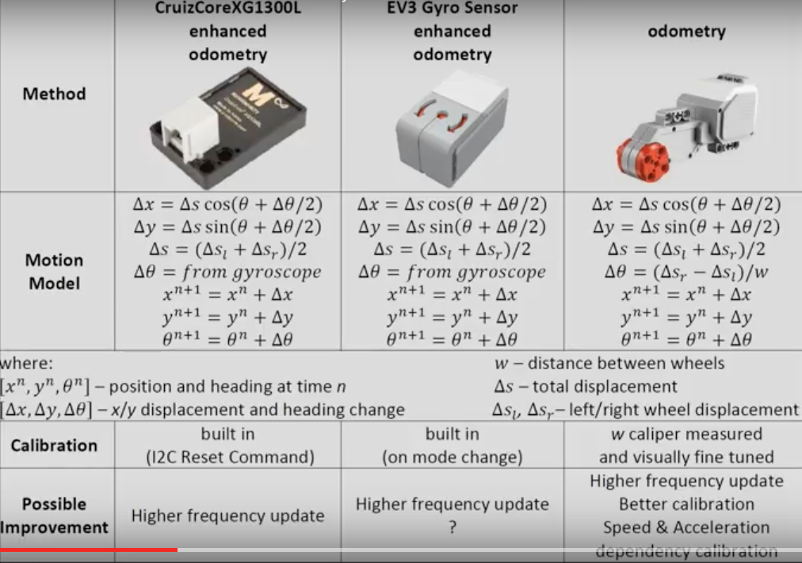

# ev3g-odometry

A EV3G project to develop to implement the Motion model using Tacho Motors and EV3 Gyros.

## Documentation

* Motion Model for a Wheeled robot
* Motion Model for a Robot using a Gyro Sensor
* [Remote Debugging with Bluetooth](./docs/EV3_Bluetooth.md)
* Trigonometry

