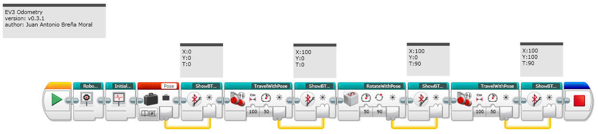

# ev3g-odometry

This project has been designed to offer a set of Custom EV3 Blocks to be used in your projects to add Odometry features to wheeled robots. The solution uses Gyro sensors to improve the accuracy of the movements.

## Why?

The EV3 programming environment offers a basic solution based on rotations to use on your wheeled robots but if you need an advanced solution based on Odometry, in many scenarios to have to move to other alternatives based on Textual programming languages as [Java LeJOS](http://www.lejos.org/), the platform [EV3Dev](http://www.ev3dev.org/) or [Robot C](http://www.robotc.net/). In the past, the NXT Brick, existed a project named [Odin](http://www.philohome.com/odin/odin.htm) designed with a similar goal but NXT programs are not compatible for EV3 so implemented this project from Scratch. This project tries to offer a solution for LEGO Users using the visual programming environment to move robots using Odometry features.

## What is Odometry?

Odometry is the use of data from motion sensors to estimate change in position over time. It is used by some legged or wheeled robots to estimate their position relative to a starting location. This method is sensitive to errors due to the integration of velocity measurements over time to give position estimates.

Source: [Wikipedia](https://en.wikipedia.org/wiki/Odometry)

## Custom EV3 Blocks

### Travel

### Travel with Pose

### Rotate

### Rotate with Pose

### Rotate with Cruizcore XG1300L

## EV3 Utility blocks

### Show BT Pose

### Read BT Pose

### Show Pose

## Usage

You can use the EV3 Blocks at home, FLL Contest or similar Contests. Remember if you are going to use this project on FLL, you will have to demostrate the Maths used in the project.

## Carpets and other surfaces where your wheeled robot suffer

If you try to use your wheeled robot on a carpet or a similar surface, you noticed that your robot don´t reach the distance that you indicated. This problem is due to some kind of errors:

**Sources of odometry error:**

* Friction
* Gear slack 
* Wheel slippage 
* Battery charge 
* Timing issues

To solve this kind of solution, a easy way is to calculate the error generated by the surface to increase the required distance that you tried to reach but it is not a perfect solution.

## Downloads

Download the program [here](./examples/odometry.ev3)

## Documentation

* [Configuration](./docs/EV3_OdometryBlocksConfiguration.md)
* [Motion Model for a Wheeled robot](./docs/EV3_WheeledMotionModel.md)
* [Remote Debugging with Bluetooth](./docs/EV3_Bluetooth.md)
* [Trigonometry](./docs/EV3_Trigonometry.md)
* [Developer notes](./docs/developerNotes.md)

## Platform

The project was tested with the following mobile platform.

[Download the LDD design](./LDD/Base1/Base1_6.lxf). In few hours it is possible to run the same tests

## Backlog

* Add the block to Rotate with the Sensor [Mindsensors AbsoluteIMU](http://www.mindsensors.com/ev3-and-nxt/15-gyro-multisensitivity-accelerometer-and-compass-for-nxt-or-ev3)
* Add the block "RotateTo(Angle in Degrees)"
* Add the block "GoTo(x,y)"

# Questions & Issues

If you have some doubt, please [create a issue](https://github.com/ilovenetruinos/ev3g-odometry/issues) in the project. 

## References

* [EV3Dev Mapping](http://www.ev3dev.org/projects/2016/08/07/Mapping/)
* [Odin](http://www.philohome.com/odin/odin.htm)
* [LeJOS RCX RotationNavigator.java](https://sourceforge.net/p/lejos/rcx/code/HEAD/tree/trunk/lejos/src/java/classes/josx/robotics/RotationNavigator.java)
* [Robot Nav](http://www.robotnav.com/position-estimation/)
* [Sariel section about Wheels](http://wheels.sariel.pl/)
* [Cartographer](https://github.com/googlecartographer/cartographer)
* [David Anderson notes about IMU Odometry](http://seattlerobotics.org/encoder/200610/Article3/IMU%20Odometry,%20by%20David%20Anderson.htm)
* [COS495-Lecture5](https://www.cs.princeton.edu/courses/archive/fall11/cos495/COS495-Lecture5-Odometry.pdf)

**Note:** My sincere thanks for [Bmegli](https://github.com/bmegli/ev3dev-mapping) by his technical support.

Juan Antonio Brenha Moral, 2016
[http://www.iloveneutrinos.com](http://www.iloveneutrinos.com)

