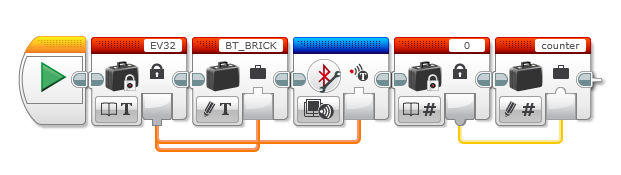
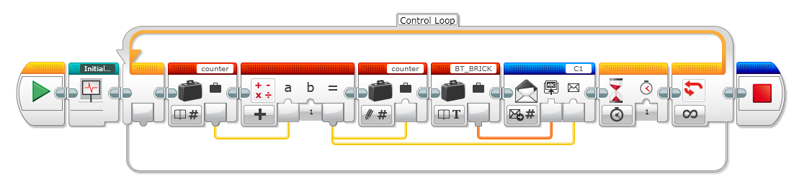
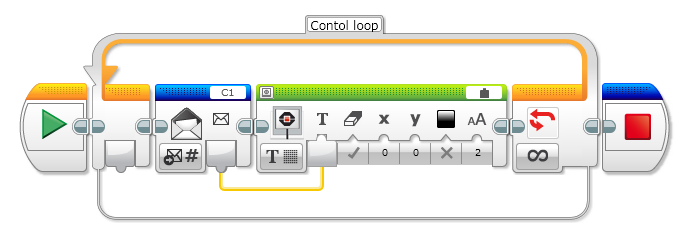

# EV3 Bluetooth

The visual environment to develop software for robots doesn´t incorporate any tool to debug programs in a remote way so one workaround is to send the useful information to another brick using a Bluetooth connection.

Some ideas used in this project:

**Initialize program:**

**Send a message:**

**Receive a message:**

**Downloads: **

[Example](../examples/btUtils.ev3)