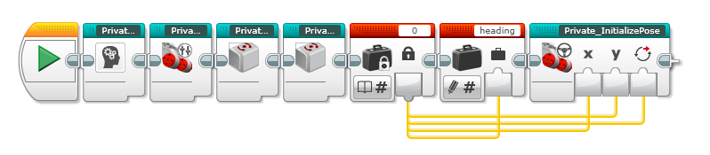

# Configuration

If you observe in the examples, every program starts using a Custom block named: "RobotConfiguration". This block is used to define your wheeled robot.

If we open the custom block named: "RobotConfiguration" you will see the following sections:

To start using the EV3 Odometry Custom Blocks, it is necessary to set some variables:

And configure some settings about motors:

If you observe, the block reset the Lego Gyro and Initialize the Pose.

